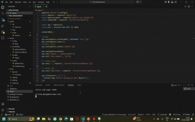

# Task Management App

A full-stack web application for managing tasks with a clean and intuitive user interface. Built with Node.js, Express, and MongoDB.

## Features

- ✅ **Create, Read, Update, Delete** tasks (CRUD operations)
- 📝 **User-friendly interface** with EJS templating
- 🎨 **Responsive design** with custom CSS
- 🚀 **RESTful API** endpoints for task management
- 💾 **MongoDB integration** for persistent data storage
- 🔄 **Auto-reload** during development with Nodemon

## Tech Stack

- **Backend**: Node.js, Express.js
- **Frontend**: EJS (Embedded JavaScript), HTML, CSS, JavaScript
- **Database**: MongoDB with Mongoose ODM
- **Middleware**: 
  - method-override (HTTP method override)
  - express-ejs-layouts (layout templating)

## Installation

### Prerequisites
- Node.js
- MongoDB
- NPM

### Steps

1. **Clone the repository**
   ```bash
   git clone <repository-url>
   cd Task_Management
   ```

2. **Install dependencies**
   ```bash
   npm install
   ```

3. **Set up environment variables**
   Create a `.env` file in the root directory:
   ```
   MONGODB_URI=mongodb://localhost:27017/task_management
   ```

4. **Start the server**
   ```bash
   npm start
   ```
   The app will run on `http://localhost:3000`

## Project Structure

```
Task_Management/
├── app.js                      # Main application file
├── package.json                # Project dependencies
├── README.md                   # This file
├── public/                     # Static files
│   ├── css/
│   │   └── main.css           # Main stylesheet
│   ├── img/                   # Images directory
│   └── script/
│       └── main.js            # Frontend JavaScript
├── server/                     # Backend logic
│   ├── config/
│   │   └── db.js              # Database connection
│   ├── controllers/
│   │   ├── apiController.js   # API endpoints logic
│   │   └── viewController.js  # View rendering logic
│   ├── models/
│   │   └── Task.js            # Task schema/model
│   └── routes/
│       ├── apiRoutes.js       # API routes
│       └── viewRoutes.js      # View routes
└── views/                      # EJS templates
    ├── layouts/
    │   └── main.ejs           # Main layout
    ├── index.ejs              # Task list view
    ├── add.ejs                # Add task view
    └── edit.ejs               # Edit task view
```

## API Endpoints

| Method | Endpoint | Description |
|--------|----------|-------------|
| GET | `/` | Display all tasks |
| GET | `/add` | Display add task form |
| POST | `/add` | Create new task |
| GET | `/edit/:id` | Display edit task form |
| PUT | `/edit/:id` | Update task |
| DELETE | `/delete/:id` | Delete task |
| GET | `/api/tasks` | Get all tasks (JSON) |
| POST | `/api/tasks` | Create task via API |
| GET | `/api/tasks/:id` | Get task by ID |
| PUT | `/api/tasks/:id` | Update task via API |
| DELETE | `/api/tasks/:id` | Delete task via API |

## 🎥 Demo


